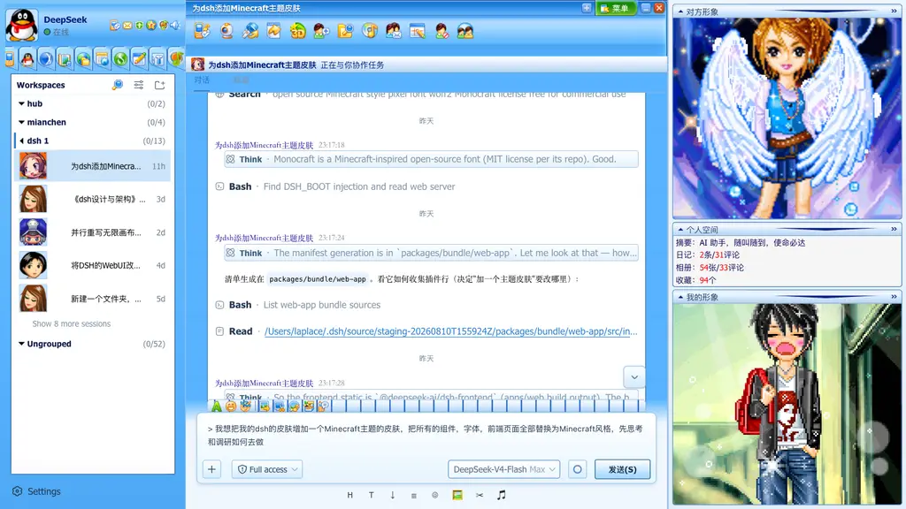

# dsh-qq2006

**把 DeepSeek Harness 的 WebUI 一键变回 2006 年的 QQ 客户端。**

QQ2006 皮肤插件：注册珊瑚蓝主题、镜像 `body[data-ds-skin]`、全局皮肤表 + 完整组件级补丁，从登录窗到聊天窗口全链路还原 2006 年的那个蓝色小企鹅。可切换、可持久化、默认皮肤零污染。

<p align="center">
  
  <br/>
  <em>聊天窗口：好友信息条 + 原版九宫格标题带 + 列表式消息 + QQ 秀右侧栏</em>
</p>

<p align="center">
  <a href="https://github.com/LaplaceYoung/dsh-qq2006/stargazers"></a>
  <a href="https://github.com/LaplaceYoung/dsh-qq2006/blob/main/LICENSE"></a>
  
  
  <a href="https://github.com/LaplaceYoung/dsh-qq2006/pulls"></a>
</p>

> ⚠️ 素材来自 [mengkunsoft/QQ2006](https://github.com/mengkunsoft/QQ2006)，为腾讯原版素材，**仅供学习交流、请勿商用**（出处见 `assets/qq2006/README.txt`）。

## ✨ 特性

- **可切换皮肤**：注册为 DSH 外观行第 4 个主题（QQ2006 皮肤），偏好持久化，刷新/重启保持；随时切回默认皮肤，**零污染契约**（所有补丁锚定 `body[data-ds-skin='qq2006']`）
- **QQ2006 登录窗**：九宫格窗口框、三态按钮、记住密码/自动登录联动、连接中动态点动画
- **主面板**：用户头部（50×50 蓝描边头像 + 6 个 mini 钮）、面板栏 10 钮（27×37 原版底条格）、分组/好友行（原版行高与 hover）、右键菜单
- **聊天窗口**：标题栏 4 钮（含 65×24 原版"菜单"文字钮）、大工具栏 12 钮、小工具栏 8 钮（全部原版素材、原生尺寸）
- **原版消息形式**：列表式消息（自己绿色昵称 / 对方深蓝紫昵称 + HH:MM:SS 时间 + 黑色正文），宋体渲染
- **QQ 秀右侧栏**：对方形象 / 个人空间（真实会话统计）/ 我的形象，默认展开
- **换肤 4 预设**：经典蓝 / 粉红 / 薄荷绿 / 紫罗兰，窗口内实时切换
- **真实交互**：Alt+S 发送、右键复制、hover 操作行（复制/引用/转发）、提示音、QQ 黄色反馈 tip

<p align="center">
  
  
</p>

## 🚀 快速开始

皮肤跟随 DSH 仓库集成（开发分支 `skin/qq2006`）：

```sh
git clone https://github.com/LaplaceYoung/deepseek-harness.git
cd deepseek-harness
git checkout skin/qq2006
pnpm install
pnpm run build
node --import tsx/esm apps/cli/src/bin.ts web
```

打开 `http://127.0.0.1:3080` → 设置 → 外观 → **QQ2006 皮肤**。

## 📦 仓库结构

```
dsh-qq2006/
├── src/
│   ├── index.ts            # 插件入口
│   ├── invariant.ts        # 包内不变量
│   ├── client/index.ts     # 主题注册 + body[data-ds-skin] 镜像 + QQ2006_TOKENS
│   └── styles/qq2006.css   # 全局皮肤表（字体/滚动条/九宫格/三态钮）
├── assets/
│   ├── qq2006/             # 完整素材（img 366 + sound 8 + 版权说明）
│   └── screenshots/        # 效果截图
├── docs/qq2006-skin.md     # 总文档：架构/按钮映射/实现清单/验证记录
├── README.package.md       # 皮肤契约（机制/补丁规则/素材）
└── LICENSE                 # BSD-3-Clause
```

## 🛠 开发

组件级补丁规则（见 [README.package.md](README.package.md)）：皮肤段只追加在组件自己的 `.module.css` 尾部，全部以 `body[data-ds-skin='qq2006']` 为祖先作用域；素材用原生尺寸；默认皮肤零回归由测试锁定。

```sh
pnpm --filter @deepseek-ai/dsh-client-ui-conversation bundle   # 单包重建
pnpm --filter @deepseek-ai/dsh-web-frontend build              # 前端重建
pnpm vitest run packages/client/ui-conversation                # 皮肤相关测试
```

## 🤝 贡献

欢迎 PR。改前先读 [docs/qq2006-skin.md](docs/qq2006-skin.md) 的映射清单与 [README.package.md](README.package.md) 的文件所有权约定；所有视觉改动必须在皮肤作用域内生效。

## 📄 许可

- 插件代码：[BSD-3-Clause](LICENSE)
- QQ2006 素材：腾讯原版，仅供学习交流，请勿商用（`assets/qq2006/README.txt`）

## 🙏 致谢

- [mengkunsoft/QQ2006](https://github.com/mengkunsoft/QQ2006)：QQ2006 原版仿制项目与素材
- [deepseek-ai/deepseek-harness](https://github.com/deepseek-ai/deepseek-harness)：DSH 及插件体系
